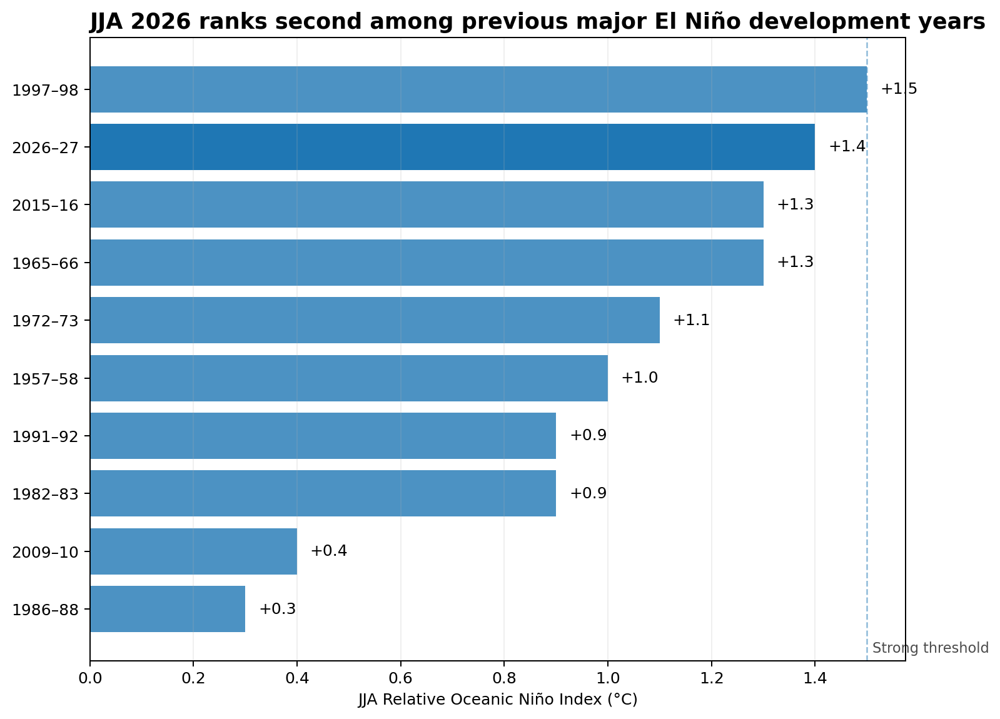

# Rapid Analysis 01: The Developing 2026 El Niño in Historical Context

**Published analysis date: 4 September 2026**

The 2026 El Niño was strengthening rapidly by mid-year, with NOAA and WMO outlooks pointing to the possibility of an unusually intense event later in 2026.

This rapid analysis asks a narrower question:

> **How exceptional is the developing 2026 El Niño compared with previous major events at the same stage of their evolution?**

The comparison uses NOAA's current **Relative Oceanic Niño Index (RONI)** history rather than mixing different ENSO indices.

## Key findings

### 1. 2026 was already close to the top of the historical range by JJA

NOAA's JJA 2026 RONI estimate is **+1.4°C**.

Among the nine previous El Niño episodes in the current NOAA RONI history that ultimately reached at least **+1.5°C**, only **1997–98** was higher at the same calendar stage, at +1.5°C.

That places 2026 **second out of ten** when the current event is included.

### 2. The spring-to-summer rise was unusually rapid

RONI increased from **0.0°C in MAM to +1.4°C in JJA 2026**.

That +1.4°C rise is larger than for any of the nine previous major events in the comparison. The next-fastest was 1997–98, which increased by +1.0°C over the same period.

This does not mean 2026 is already the strongest El Niño in the historical record. It means its development to this point has been unusually fast.

### 3. NOAA's forecast moves beyond the historical observed range, but remains a forecast

The highest historical RONI value in the pre-2026 record is **+2.4°C**.

NOAA's August 2026 outlook has a median forecast of:

| Season | Median RONI forecast |
|---|---:|
| JAS | +1.79°C |
| ASO | +2.14°C |
| SON | +2.47°C |
| OND | +2.66°C |
| NDJ | +2.58°C |
| DJF | +2.23°C |

The median trajectory therefore moves above the historical observed maximum, but the forecast distribution remains wide enough that this should not be treated as an observed record or a deterministic outcome.

NOAA's 13 August 2026 ENSO Diagnostics Discussion estimated a **69% probability that OND 2026 reaches at least +2.5°C RONI**, which would exceed previous El Niño events in the RONI record since 1950.

## Data and definitions

The historical analysis uses NOAA Climate Prediction Center's **ERSSTv6 Relative Oceanic Niño Index**.

RONI is a three-month running measure based on Niño 3.4 sea-surface-temperature anomalies after accounting for the mean tropical SST anomaly.

For this analysis, a **major historical El Niño** is operationally defined as a NOAA RONI El Niño episode that reaches a peak RONI of at least **+1.5°C**, corresponding to strong or very strong RONI intensity.

"Major" is shorthand used for this analysis rather than an official NOAA category.

The resulting historical comparison set is:

- 1957–58
- 1965–66
- 1972–73
- 1982–83
- 1986–87
- 1991–92
- 1997–98
- 2009–10
- 2015–16

Historical events are aligned by overlapping three-month calendar season from **MAM through DJF**.

## Important limitations

The latest 2026 RONI observations are **real-time estimates**. NOAA states that recent values may be revised for up to two months after initial publication.

Observed values, historical observations, NOAA forecasts and forecast uncertainty are kept separate.

The analysis does not infer regional weather impacts directly from RONI strength.

WMO material sometimes quotes conventional Niño 3.4 anomalies. Those figures are not merged into the historical RONI comparison.

## Reproducibility

The repository preserves dated copies of the NOAA historical and forecast pages used for this analysis, together with SHA-256 checksums.

The published analysis is based on the source snapshot retrieved on **4 September 2026**.

Rerun sequence:

1. `python -m pip install -r requirements.txt`
2. `python python\01_prepare_enso_data.py`
3. `python python\02_analyse_el_nino.py`

The analysis script contains validation gates for the central published findings. If NOAA later revises the current RONI values sufficiently to change those findings, the script stops rather than silently reproducing stale conclusions.

## Sources

- NOAA Climate Prediction Center: Relative Oceanic Niño Index
- NOAA Climate Prediction Center: Official RONI Outlook
- NOAA Climate Prediction Center: ENSO Diagnostics Discussion
- World Meteorological Organization: August/September 2026 El Niño update

Full source links and comparability notes are in [`data_sources.md`](data_sources.md).
