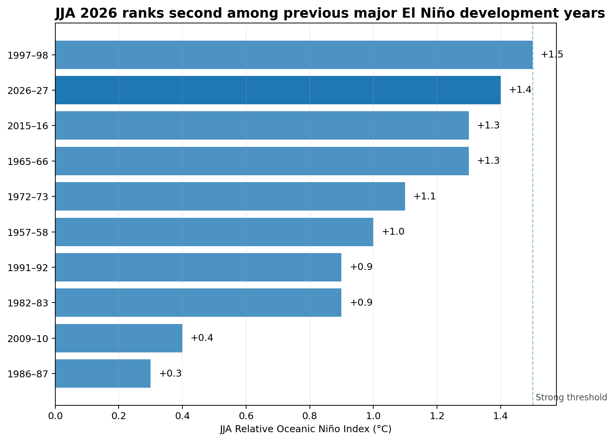
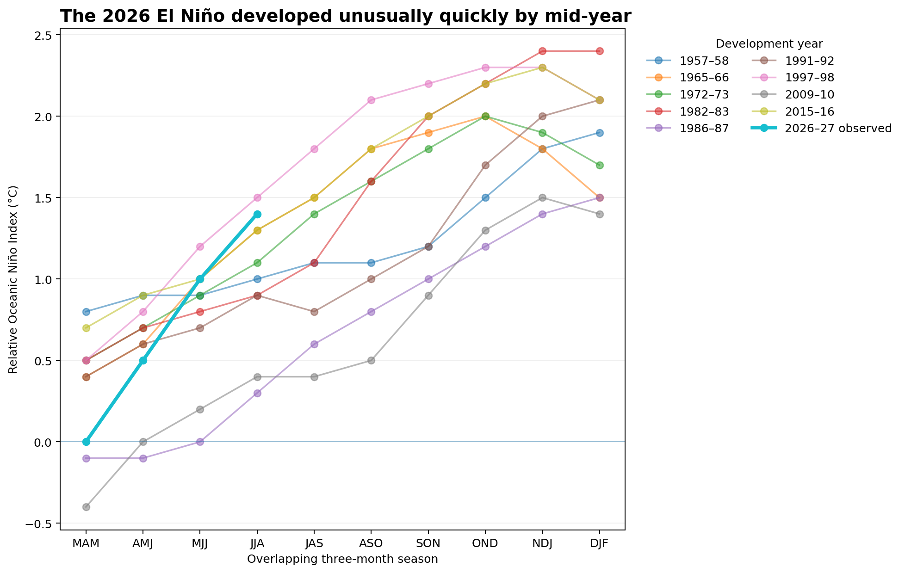
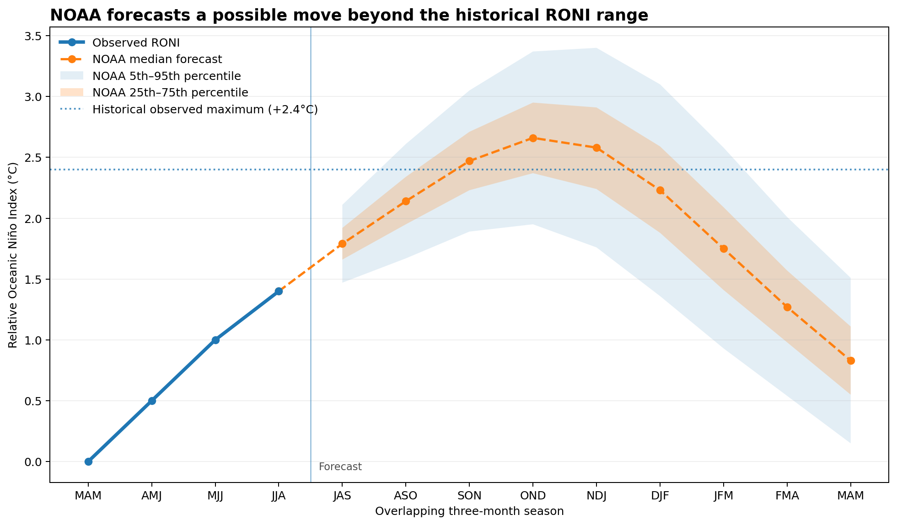

---
title: Rapid Analysis 01
---

# The Developing 2026 El Niño in Historical Context

**Rapid analysis published 4 September 2026**

NOAA's latest observed RONI estimate shows the 2026 El Niño developing unusually quickly. This analysis compares it with previous major events at the same seasonal stage, while keeping observed conditions separate from NOAA's forecast.

## How exceptional is 2026 so far?

JJA 2026 RONI is **+1.4°C**.

Among nine previous El Niño episodes that eventually reached strong or very strong RONI intensity, only **1997–98** was higher at the same calendar stage.

## An unusually fast rise

RONI moved from **0.0°C in MAM to +1.4°C in JJA**.

That is the largest MAM-to-JJA rise in this historical comparison set. The previous maximum was +1.0°C during 1997–98.

The distinction matters: 2026's **rate of development** has been exceptional, but its observed strength has not yet exceeded the historical record.

## What happens next is still uncertain

The pre-2026 historical RONI maximum is **+2.4°C**.

NOAA's August 2026 median forecast rises above that level during the northern-hemisphere autumn, reaching +2.66°C in OND. The forecast distribution remains broad, however, and these values are not observations.

NOAA's 13 August Diagnostics Discussion estimated a **69% chance of OND reaching at least +2.5°C RONI**.

That makes a record-strength event a credible possibility, not an observed result.

## What the analysis can and cannot say

The evidence supports three conclusions:

- 2026 is already near the top of the historical distribution at the same seasonal stage.
- Its MAM-to-JJA development was faster than any previous major event in this comparison.
- NOAA currently sees a substantial possibility of the event moving beyond the historical RONI range later in 2026.

It does **not** follow that a particular country will experience a specific extreme-weather outcome. ENSO strength and regional impacts are related, but they are not interchangeable.

The latest RONI observations are also real-time estimates and may be revised.

## Method

Historical events were selected using a reproducible rule rather than by choosing famous El Niño years retrospectively.

The comparison includes NOAA RONI El Niño episodes reaching a peak of at least **+1.5°C** and aligns their development years by overlapping three-month season.

Historical comparisons use RONI consistently. Conventional Niño 3.4 or ONI values quoted by other sources are not merged into the series.

## Technical details

The project is reproducible in Python using pandas and Matplotlib. Dated NOAA source snapshots and checksums are retained with the analysis.

[View the full repository](https://github.com/jsklair/rapid_analysis_01_2026_el_nino)

[Read the detailed README](https://github.com/jsklair/rapid_analysis_01_2026_el_nino#readme)
